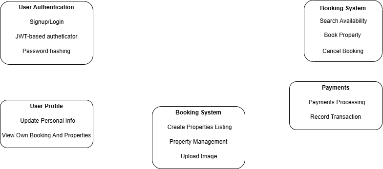

# Airbnb Clone Backend - Features and Functionalities

This document outlines the key backend features and functionalities of the Airbnb Clone project, structured into clearly defined modules. The diagram below visually represents how the system components are organized and interact.

---

## 🔐 User Authentication
- User signup and login functionality
- Password hashing for security (e.g., bcrypt)
- JWT-based authentication for route protection

## 👤 User Profile
- View and update personal information
- View user's own bookings and listed properties

## 🏠 Property Management
- Hosts can create, edit, and delete property listings
- Listings include title, description, location, price, and images
- Upload and manage property photos

## 📅 Booking System
- Search for property availability
- Book a property for a date range
- Cancel or modify an existing booking
- Ensure availability checks to prevent double bookings

## 💳 Payments
- Integration with payment gateways (e.g., Stripe or PayPal)
- Payment processing for bookings
- Record and view transaction history

## ⭐ Reviews and Ratings
- Guests can rate and review properties after a stay
- Hosts can optionally rate guests
- Admin moderation of abusive reviews

## 💬 Messaging System
- In-app chat system between guests and hosts
- Pre-booking and post-booking communication
- Notifications for new messages

## 🛠️ Admin Features (Optional)
- Admin dashboard for content moderation
- Ban users, remove listings or reviews
- Analytics and metrics monitoring

---

## ✅ Summary

These features ensure the platform supports secure user management, property listings, booking workflows, real-time messaging, and financial transactions—mirroring the core backend infrastructure of an Airbnb-like service.

---